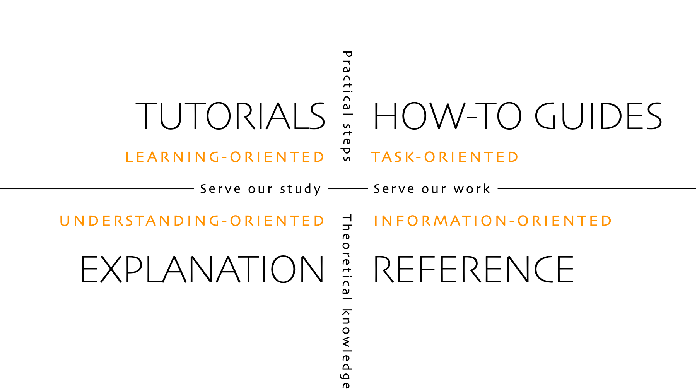

# docs-reorg README

This README describes the new Volto documentation organization.
We follow the [Diátaxis framework](https://diataxis.fr/) for organizing documentation.

## Tutorials

[Tutorials](https://diataxis.fr/tutorials/) are oriented toward learning.
They provide practical steps that serve our study.

Most of Volto's tutorials are in the [GitHub repository `plone/training`](https://github.com/plone/training), and are served from the [Plone Training website](https://training.plone.org/).

There may be some tutorials buried deep inside Volto documentation.
Additionally some content from the Trainings may be well-suited for a tutorial.
Both of these should be moved to the directory `/tutorials/`.

## Guides

[Guides](https://diataxis.fr/how-to-guides/) are oriented toward tasks.
They provide practical steps that serve our work.
Guides are located in the directory `/guides/`.

Examples of guides include the following.

-   Create a new project
-   Create an add-on
-   Contribute to Volto
-   Integrate Volto into an existing project

## Explanation

[Explanation](https://diataxis.fr/explanation/#) documentation is oriented toward deep and broad understanding.
They provide theoretical knowledge that serve our study.
Explanation documentation is located in the directory `/explanation/`.

Examples of explanation documentation include:

-   Architecture design
-   Explanations of why choices and decisions were made

## Reference

[Reference](https://diataxis.fr/reference/) documentation is oriented toward information.
It provides theoretical knowledge that serves our work.
Reference documentation is located in the directory `/reference/`.

Examples of reference material include:

-   Environment variables
-   Configuration settings
