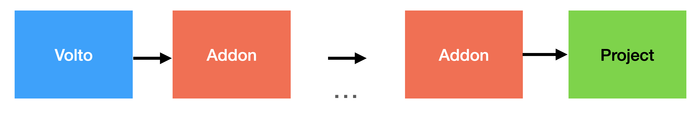

---
myst:
  html_meta:
    "description": "Add-on and project configuration pipeline"
    "property=og:description": "Add-on and project configuration pipeline"
    "property=og:title": "Add-on and project configuration pipeline"
    "keywords": "Volto, Plone, Volto add-ons, Volto Project"
---
%Explanation
# Add-on and project configuration pipeline

Volto build its configuration out of Volto's configuration defaults, add-ons configuration, and project configuration.
This is called the configuration pipeline.



It's applied in this particular order.
Configurations can be overriden at a later stage.

## All-in with add-on approach

You can take full advantage of the configuration pipeline and do not use the project configuration at all.
You can create a "policy" core product for your project, and use another for your project's theme.
This way, the project itself renders as a simple boilerplate, expendable or rebuild-able at any time.
You can also reuse add-ons across projects, and adjust them using another add-ons, depending on the other projects requirements.

```{deprecated} Volto 18.0.0
The project configuration approach is deprecated and will be removed in Volto 19.
```

## Define your add-ons programatically

Having the `addons` key in `package.json` is not flexibile enough in complex scenarios.
You can load your add-ons programatically, outside `package.json` using `volto.config.js` like this:

```js
module.exports = {
    addons: ['@eeacms/volto-accordion-block']
}
```

This is an "escape hatch" where you can use logic and environment conditions to define the add-ons to be loaded in the current project. Take a look:


```js
let addons = [];
if (process.env.MY_SPECIAL_ENV_VAR) { // Does not have to be RAZZLE_
  addons = ['volto-my-awesome-special-add-on'];
}

if (process.env.MARKER_FOR_MY_SECRET_PROJECT) { // Does not have to be RAZZLE_
  addons = [
    '@kitconcept/volto-heading-block',
    '@kitconcept/volto-slider-block',
    'volto-my-secret-project-add-on',
  ];
}

module.exports = {
  addons: addons,
};
```

They are added to the existing ones in `package.json`.

```{seealso}
{doc}`../configuration/volto-config-js`
```
