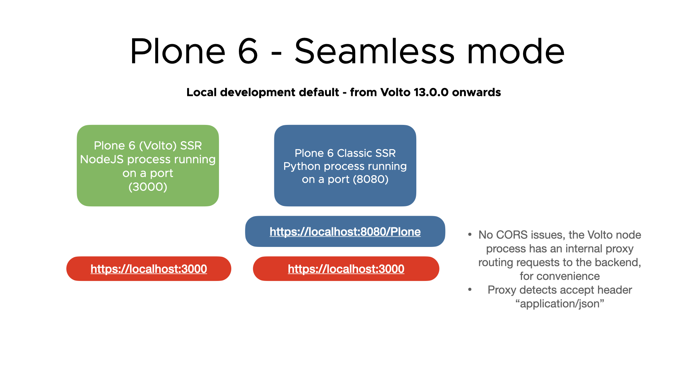
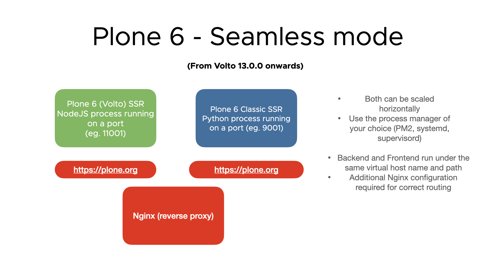

# Seamless mode

!!! note
    This feature is available since Volto 13.

The seamless mode was introduced in Volto 13. It's the ability to host both the frontend
and the backend under the same server name, making the access to the API seamless (as if
it was in the same server and not outside).

## The goal?

Achieve Zero configuration (avoiding at the same time hardcoded `RAZZLE_API_PATH` or
other vars in code) with good sensible defaults when setting up deployments.

Having in production this kind of setup, where both Volto and the API lives under the
same sun. The content negotiation stays, so any API call is made with the Accept header,
so it's routed to the backend.

The idea was still use the same `RAZZLE_API_PATH` meaning, and do not introduce any
breaking change, so old deployments in place continue working as they are.

## Development environment

* Seamless mode by default
* Calls to API is always routed through internal proxy, `http://localhost:3000` is both
  Volto and Plone by default.
* `RAZZLE_API_PATH` sensible default is `http://localhost:8080/Plone` (no change of
  behaviour)



## Production environment

* Nothing changes for old deployments, all work the same way if `RAZZLE_API_PATH` is set
* If you want seamless in production as well you need to setup your reverse proxy (see
  attached Nginx reference config) properly, so the reverse proxy detects the accept
  header and route the requests properly, and remove API_PATH env var from your build In
  seamless mode no API_PATH is required (and should not be present at build time), but
  the Host header must be set in the reverse proxy (see attached Nginx reference config)
* `yarn start:prod` does not work without setting a build time (or runtime)
  `RAZZLE_API_PATH` enviroment variable. This is unavoidable if we want all the sensible
  defaults in place in production mode, so it no longer defaults to
  `http://localhost:8080/Plone`



## Advantages of the seamless mode

The zero config and the lack of having to rely on hardcoded variable names in the build
is the main advantage of seamless mode.

Theoretically, you could deploy several sites using the same Volto SSR server without
recompiling (just using the Host header in the reverse proxy)

Opens the door for http://servername/sitename deployments as well, so several sites
hosted the same Volto SSR server, we could use headers (same as Pyramid) to accomplish
that as well.

All internal links are app ones, so a link to a page /my-page will be returned by the
API as is. So flattenToAppURL will still be required (for old deployments) but if
seamless is adopted, it won't be required anymore in mid-term.

The Plone classic UI is not public (which in some points clients might find it ugly and
problematic from the SEO point of view), with the bonus that the indexers cannot reach
them.

## Nginx example config for seamless mode deployments

```conf
upstream backend {
    server host.docker.internal:8080;
}
upstream frontend {
    server host.docker.internal:3000;
}

server {
  listen 80;
  server_name myservername.org;

  client_max_body_size 1G;

  access_log /dev/stdout;
  error_log /dev/stdout;

  location ~(.*)$ {
    location ~* \.(js|jsx|css|less|swf|eot|ttf|otf|woff|woff2)$ {
        add_header Cache-Control "public";
        expires +1y;
        proxy_pass http://frontend;
    }
    location ~* static.*\.(ico|jpg|jpeg|png|gif|svg)$ {
        add_header Cache-Control "public";
        expires +1y;
        proxy_pass http://frontend;
    }

    if ($http_accept = 'application/json') {
        rewrite ^(.*) /VirtualHostBase/http/local.kitconcept.io/Plone/VirtualHostRoot$1 break;
        proxy_pass http://backend;
        break;
    }

    location ~ /@@images/ {
        rewrite ^(.*) /VirtualHostBase/http/local.kitconcept.io/Plone/VirtualHostRoot$1 break;
        proxy_pass http://backend;
        break;
    }

    location ~ /@@download/ {
        rewrite ^(.*) /VirtualHostBase/http/local.kitconcept.io/Plone/VirtualHostRoot$1 break;
        proxy_pass http://backend;
        break;
    }

    proxy_set_header        Host $host;
    proxy_set_header        X-Real-IP $remote_addr;
    proxy_set_header        X-Forwarded-For $proxy_add_x_forwarded_for;
    proxy_set_header        X-Forwarded-Proto $scheme;
    proxy_pass              http://frontend;
  }
}
```
