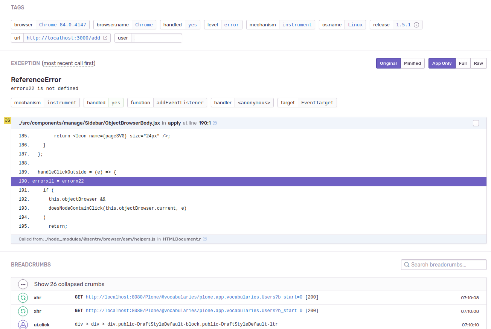

---
myst:
  html_meta:
    "description": "Volto Integration with Sentry"
    "property=og:description": "Volto Integration with Sentry"
    "property=og:title": "Integration with Sentry"
    "keywords": "Volto, Plone, frontend, React, Integration, Sentry, volto-sentry, add-on"
---

# Integration with Sentry

Volto can be configured to work with [Sentry.io](https://sentry.io/welcome/).
Sentry is a monitoring platform that can help identify the cause of errors in your project.


## Prerequisities

1.  Install the add-on [`@plone-collective/volto-sentry`](https://www.npmjs.com/package/@plone-collective/volto-sentry).
2.  In Sentry, create a new organization, and add a project to it.
3.  On the projects settings page, from {guilabel}`Client Keys (DSN)`, take the `SENTRY_DSN`.
4.  Create an API Token: in the top-left corner, click on {guilabel}`your name -> API keys`, and create a new token.
    {guilabel}`project:write` scope should be selected.

```{note}
Instructions tested with Sentry 9.1.2.
```

```{versionchanged} 16.0.0.alpha.45
Sentry was moved from Volto core and into a separate add-on [`volto-sentry`](https://github.com/collective/volto-sentry).
```


## Setup

Volto creates bundles of the source codes.
If an error is sent to Sentry, it will only show the traceback in the bundles.
To have a nice traceback, we have to upload the source code and source map to Sentry.
This can be configured in our Volto application to do all the steps automatically.

There are 2 ways to configure the application.


### 1. Build time

This method can be used when the application is deployed directly on a host machine and built locally.

The configuration is done using environment variables.


`SENTRY_DSN`
:   Required to enable the feature.

`SENTRY_URL`
:   The URL of Sentry.

`SENTRY_AUTH_TOKEN`
:   The authentication token for Sentry.

`SENTRY_ORG`
:   The name of the organization in Sentry.

`SENTRY_PROJECT`
:   The name of the project in Sentry.

`SENTRY_RELEASE`
:   The release number.

`SENTRY_FRONTEND_CONFIG`
:   Optional, here we can specify `TAGS` and `ADDITIONAL DATA` for the messages we send to Sentry from the browser.

`SENTRY_BACKEND_CONFIG`
:   Same as `SENTRY_FRONTEND_CONFIG`, but we configure the messages from the backend.

If these environment variables are configured when the app is built, a new release will be created in Sentry, and the source code and source maps will be uploaded to it.
After starting the application, if an error occurs, the errors will be sent to Sentry, and will be linked to the specified release.

Example usage:

```shell
SENTRY_URL=https://mysentry.com \
SENTRY_AUTH_TOKEN=foo \
SENTRY_ORG=my_organization \
SENTRY_PROJECT=new_project \
SENTRY_RELEASE=2.0.0 \
SENTRY_DSN=https://boo@sentry.com/1 yarn build
node build/server.js
```


### 2. Runtime

Within your Volto project or a dedicated Volto add-on, you can configure Sentry via the `settings.sentryOptions` configuration key:

```js
import {
  settings as defaultSettings,
} from '@plone/volto/config';

const settings = {
  ...defaultSettings,
  sentryOptions: {
    ...defaultSettings.sentryOptions,
    dsn: 'https://key@sentry.io/1',
    environment: 'production',
    release: '1.2.3',
    serverName: 'volto',
    tags: {
      site: 'foo.bar',
      app: 'test_app',
      logger: 'volto',
    },
    extras: {
      key: 'value',
    },
    integrations: [
        ...defaultSettings.sentryOptions.integrations,
        // new MyAwesomeIntegration()
    ]
  }
};
```

See more about [Sentry Custom Integrations](https://docs.sentry.io/platforms/javascript/configuration/integrations/custom/).

In case you plan to use the application using Docker, you will not want to have the Sentry setup in the Docker image.
The configuration for setting up Sentry on runtime is very similar to how we set it up for build time, but with some small differences.

`SENTRY_URL`
:   The URL of Sentry.

`SENTRY_AUTH_TOKEN`
:   The authentication token for Sentry.

`SENTRY_ORG`
:   The name of the organization in Sentry.

`SENTRY_PROJECT`
:   The name of the project in Sentry.

`SENTRY_RELEASE`
:   The release number.

`RAZZLE_SENTRY_DSN`
:   Required to enable the feature.

`RAZZLE_SENTRY_FRONTEND_CONFIG`
:   Optional, here we can specify `TAGS` and `ADDITIONAL DATA` for the messages we send to Sentry from the browser.

`RAZZLE_SENTRY_BACKEND_CONFIG`
:   Same as `RAZZLE_SENTRY_FRONTEND_CONFIG`, but we configure the messages from the backend.

`RAZZLE_SENTRY_RELEASE`
    The release number, which should be the same as `SENTRY_RELEASE`.

In the entrypoint of our Docker image, we have to add the script `./create-sentry-release.sh`.
When the container is started, this script will check in Sentry if the specified release already exists, and if not, it will create it and upload the source code and the source maps.
The script can also be executed manually, and if we want to overwrite the existing files in Sentry, we can use the `--force` flag.

```shell
./create-sentry-release.sh --force
```

Example of entrypoint.

```shell
#!/usr/bin/env bash
set -Ex

function apply_path {
    mainjs=./build/server.js
    bundlejs=./build/public/static/js/*.js
    test -f $mainjs

    echo "Check that we have API_PATH and API vars"
    test -n "$API_PATH"

    sed -i "s#VOLTO_API_PATH#${API_PATH}#g" $mainjs
    sed -i "s#VOLTO_API_PATH#${API_PATH}#g" $bundlejs
    sed -i "s#VOLTO_INTERNAL_API_PATH#${INTERNAL_API_PATH}#g" $mainjs
    sed -i "s#VOLTO_INTERNAL_API_PATH#${INTERNAL_API_PATH}#g" $bundlejs

    gzip -fk $mainjs
}

# Should we monkey patch?
test -n "$API_PATH" && apply_path

./create-sentry-release.sh

echo "Starting Volto"
exec "$@"
```

Starting the container with Docker.

```shell
docker run -p 3000:3000 -p 3001:3001 \
  -e SENTRY_URL=https://mysentry.com \
  -e SENTRY_AUTH_TOKEN=foo \
  -e SENTRY_ORG=my_organization \
  -e SENTRY_PROJECT=new_project \
  -e SENTRY_RELEASE=2.0.0 \
  -e RAZZLE_SENTRY_DSN=https://boo@sentry.com/1 \
  -e RAZZLE_SENTRY_RELEASE=2.0.0 volto-app:latest
```

Or using Docker Compose:

```yaml
version: '3'
services:
  volto:
    build: volto
    ports:
      - 3000:3000
      - 3001:3001
    environment:
      - SENTRY_URL=https://mysentry.com
      - SENTRY_AUTH_TOKEN=foo
      - SENTRY_ORG=my_organization
      - SENTRY_PROJECT=new_project
      - SENTRY_RELEASE=2.0.0
      - RAZZLE_SENTRY_DSN=https://boo@sentry.com/1
      - RAZZLE_SENTRY_RELEASE=2.0.0
```


## Configuration options

This applies to both `SENTRY_FRONTEND_CONFIG` and `SENTRY_BACKEND_CONFIG`.

If you are using _build time_ configuration, you have to use `SENTRY_FRONTEND_CONFIG` and `SENTRY_BACKEND_CONFIG`.

If you are using _runtime_ configuration, use `RAZZLE_SENTRY_FRONTEND_CONFIG` and `RAZZLE_SENTRY_BACKEND_CONFIG`.

We have the possibility to add `TAGS` and `ADDITIONAL DATA` for our messages for categorization in Sentry.
We can configure these two variables separately, as we might want to separate the messages from frontend and backend.

Example of configuration.

```json
{
  "tags":
  {
      "site":"www.test.com",
      "app":"test_app"
  },
  "extras":
  {
      "logger":"javascript-frontend"
  },
  "environment": "development",
  "serverName": "server #1",
  "maxBreadcrumbs": 50
}
```

Example of usage with build time setup.

```console
SENTRY_URL=https://mysentry.com
SENTRY_AUTH_TOKEN=foo
SENTRY_ORG=my_organization
SENTRY_PROJECT=new_project
SENTRY_RELEASE=2.0.0
SENTRY_DSN=https://boo@sentry.com/1
SENTRY_FRONTEND_CONFIG='{"tags":{"site":"www.test.com","app":"test_app"},"extras":{"logger":"javascript-frontend", "release":"1.4.1"}}'
SENTRY_BACKEND_CONFIG='{"tags":{"site":"www.test.com","app":"test_app"} yarn build
node build/server.js
```

Example with Docker Compose.

```yaml
version: '3'
services:
  volto:
    build: volto
    ports:
      - 3000:3000
      - 3001:3001
    environment:
      - SENTRY_URL=https://mysentry.com
      - SENTRY_AUTH_TOKEN=foo
      - SENTRY_ORG=my_organization
      - SENTRY_PROJECT=new_project
      - SENTRY_RELEASE=2.0.0
      - RAZZLE_SENTRY_DSN=https://boo@sentry.com/1
      - RAZZLE_SENTRY_RELEASE=2.0.0
      - RAZZLE_SENTRY_FRONTEND_CONFIG={"tags":{"site":"www.test.com","app":"test_app"},"extras":{"logger":"javascript-frontend"}}
      - RAZZLE_SENTRY_BACKEND_CONFIG={"tags":{"site":"www.test.com","app":"test_app"},"extras":{"logger":"javascript-backend", "server":"server#1"}}
```

## Example messages in Sentry

1.  List of messages
    
2.  Messages from the frontend, with its own `TAGS` and `ADDITIONAL DATA`
    
3.  Messages from the backend, with its own `TAGS` and `ADDITIONAL DATA`
    
